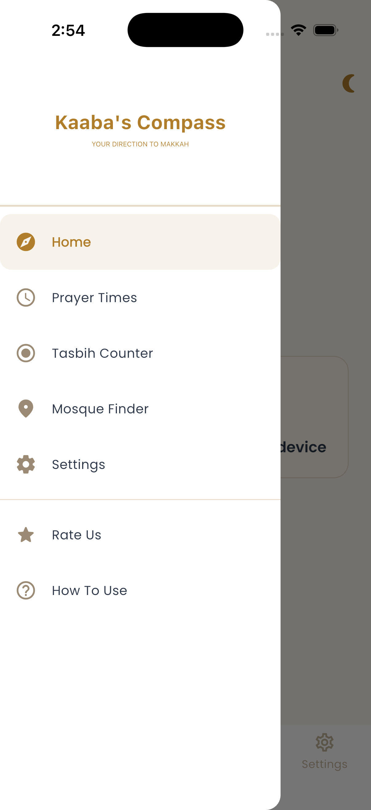
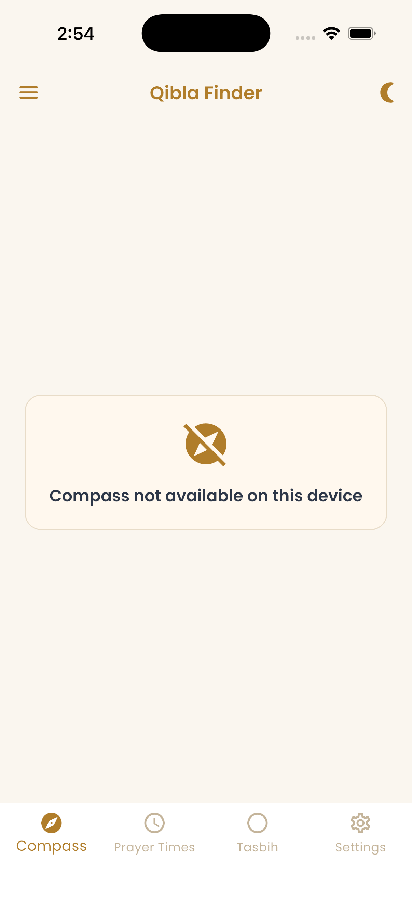
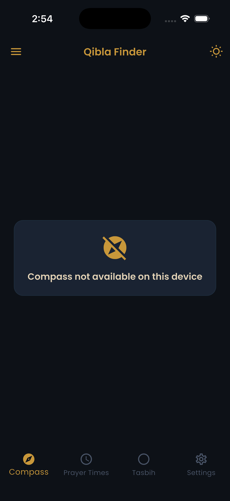
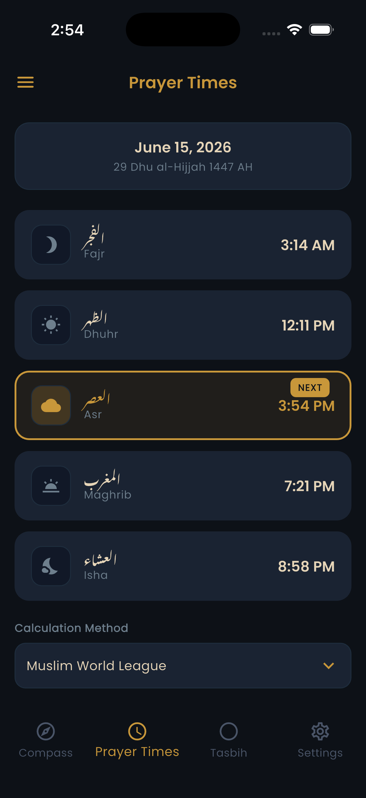
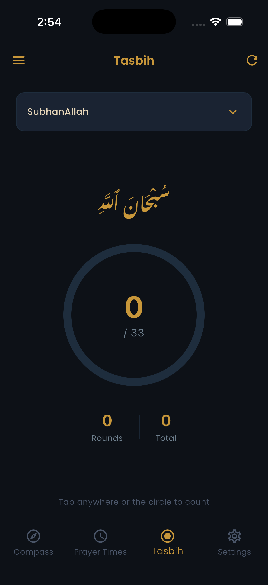
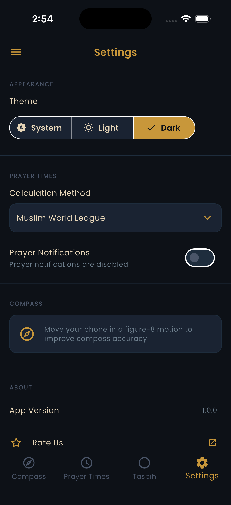
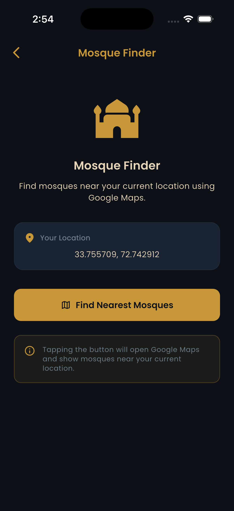

# Kaaba's Compass

A production-ready Flutter app for Muslims featuring a Qibla finder, accurate prayer times, a tasbih counter, and a mosque locator — all with a clean light/dark UI.

## Screenshots

| Drawer | Qibla (Light) | Qibla (Dark) | Prayer Times |
|:---:|:---:|:---:|:---:|
|  |  |  |  |

| Tasbih | Settings | Mosque Finder |
|:---:|:---:|:---:|
|  |  |  |

## Features

- **Qibla Compass** — Real-time needle pointing toward the Kaaba using the device's magnetometer and GPS. Includes a figure-8 calibration tip for accuracy.
- **Prayer Times** — Daily Fajr, Dhuhr, Asr, Maghrib, and Isha times with Hijri date display and a "Next Prayer" highlight. Multiple calculation methods supported.
- **Tasbih Counter** — Digital tasbeeh with Arabic text display, configurable dhikr (SubhanAllah, Alhamdulillah, AllahuAkbar), round tracking, haptic feedback, and a 33-count target.
- **Mosque Finder** — Detects your GPS coordinates and opens Google Maps to show nearby mosques.
- **Settings** — System / Light / Dark theme toggle, prayer calculation method selector, and prayer notification toggle.

## Tech Stack

| Layer | Choice |
|---|---|
| Framework | Flutter 3 (Dart) |
| State Management | Riverpod |
| Prayer Times | Adhan |
| Location | Geolocator + Geocoding |
| Compass | flutter_compass |
| Notifications | flutter_local_notifications |
| Fonts | Google Fonts |

## Getting Started

### Prerequisites

- Flutter SDK `>=3.0.0`
- Android SDK / Xcode (for iOS builds)

### Run locally

```bash
git clone https://github.com/your-username/Kaabas-Compass.git
cd Kaabas-Compass
flutter pub get
flutter run
```

### Build

```bash
# Android APK (direct install)
flutter build apk --release

# Android App Bundle (Play Store)
flutter build appbundle --release

# iOS (requires macOS + Xcode)
flutter build ios --release
```

## Permissions

| Permission | Reason |
|---|---|
| Location (fine) | Qibla direction and prayer times require your coordinates |
| Notifications | Prayer time alerts |

## Project Structure

```
lib/
├── core/              # App-wide config, theme, routing
├── features/
│   ├── compass/       # Qibla compass screen & logic
│   ├── prayer_times/  # Prayer schedule & notifications
│   ├── tasbih/        # Counter screen
│   ├── mosque_finder/ # Nearby mosque search
│   └── settings/      # User preferences
└── shared/            # Reusable widgets and utilities
```

## Version

`1.0.0` — Initial release

## License

MIT
